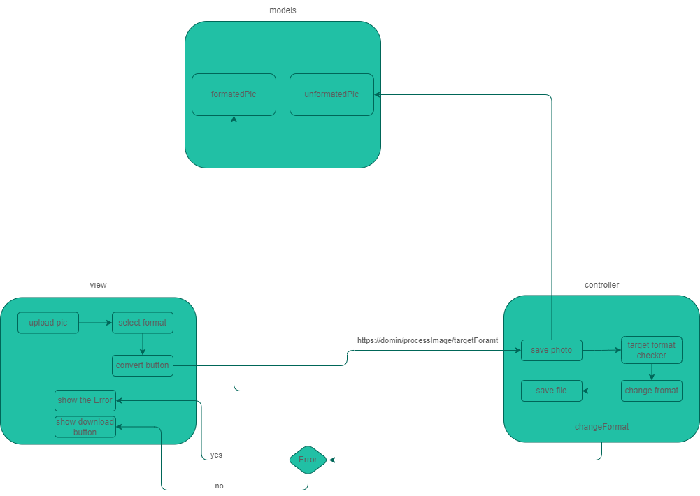

# Image Converter Web App

Welcome to the Image Converter web app repository! This web app allows you to easily convert images from one format to another. Whether you have a JPEG, JPG, PNG, WebP, AVIF, TIFF, or SVG file, you can convert it to JPEG, JPG, JPE, PNG, AVIF, TIFF, TIF, or WebP format with just a few clicks.

## Features

-   **Format Support:** Convert images between JPEG, JPG, PNG, WebP, AVIF, TIFF, SVG formats.
-   **Node.js and Express.js Backend:** The backend is powered by Node.js and Express.js, utilizing the Sharp package for efficient image processing.
-   **Vanilla JS and Bootstrap Frontend:** The frontend is built using Vanilla JS for simplicity and Bootstrap for a clean and responsive user interface.
- **Design Pattern:** The Model-View-Controller (MVC) design pattern is employed to provide a structured and modular architecture, enhancing maintainability and scalability of the codebase.
-   **Logging:** Utilizes the Morgan package for logging purposes.
-   **File Upload:** Implemented with Multer to easily handle file uploads.
-   **Performance:** PM2 is used for process management, ensuring optimal performance.
-   **Testing:** SuperTest with Jest is integrated for API testing to maintain reliability.
-   **Dockerize:** The project is fully Dockerize, allowing for quick and easy deployment.




## Getting Started

### Prerequisites

-   [Node.js and npm](https://docs.npmjs.com/downloading-and-installing-node-js-and-npm) installed on youn machine.
-   [Docker](https://www.docker.com/products/docker-desktop) installed on your machine.

### Running the App

1. Clone the repository:

```bash
git clone https://github.com/smh-kneonix/image-converter.git
```

2. Navigate to the project directory:

```bash
cd image-converter
```

3. Run the following command to start the app:

```bash
docker pull node
docker build -t username/image-converter .
docker run -it -p 8000:8000 username/image-converter
```

The app will be accessible at `http://localhost:8000`.

> HINT: make sure config the .env file by your preference

## Testing

To run tests, use the following command:

```bash
npm test
```

